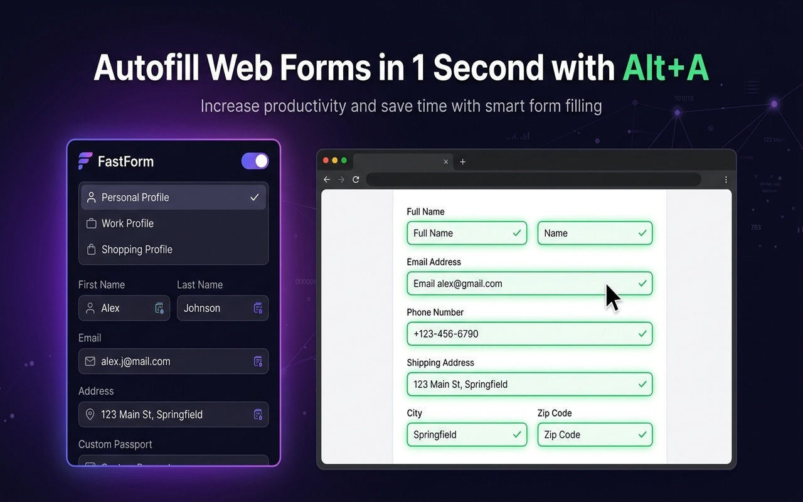

# FastForm
> **One-Click Form AutoFiller & Automation for Google Chrome**  
> Save unlimited profile templates and autofill web forms instantly with `Alt + A`. 100% Free & Privacy-First.




---

## Features

- **1-Click Form Autofill (`Alt + A`)**: Fill complex web forms in under 1 second using keyboard shortcuts or the extension popup.
- **Unlimited Profiles**: Create and switch between multiple profile templates for Personal, Work, Side-Hustles, or Shopping.
- **5-Language Cross-Lingual Thesaurus Engine**: Intelligently detects standard HTML attributes and matches keywords across **English, Korean, Japanese, Chinese, and Spanish**.
- **Custom Key-Value Fields**: Define custom answers for unique input fields (e.g. Passport Number, Crypto Wallet Address, LinkedIn URL, Tax ID/VAT).
- **Smart Name Parser**: Automatically splits or merges `First Name` and `Last Name` depending on individual site form layouts.
- **JSON Backup & Migration**: Export and import your profiles with a single click to easily sync across different computers.
- **100% Privacy-First**: All data is encrypted and saved strictly inside your browser's local storage (`chrome.storage.local`). No personal data ever leaves your device.

---

## How to Install

### Option 1: Chrome Web Store (Recommended)
Simply search for **`FastForm`** in the [Chrome Web Store](https://chromewebstore.google.com) and click **Add to Chrome**!
> **한국어 안내**: 크롬 웹스토어 검색창에서 **`FastForm`**을 검색하시면 클릭 한 번으로 바로 설치하여 사용하실 수 있습니다.

---

### Option 2: Local Developer Mode Installation

1. Clone or download this repository:
   ```bash
   git clone https://github.com/YOUR_USERNAME/FastForm.git
   ```
2. Open Google Chrome and navigate to `chrome://extensions`.
3. Enable **Developer mode** using the toggle switch in the top-right corner.
4. Click **Load unpacked** (압축해제된 확장 프로그램을 로드합니다).
5. Select the `FastForm` project folder.
6. Open any web form (or test page `test.html`) and press **`Alt + A`**!

---

## Screenshots

| Popup Interface | Cross-Lingual Autofill Demo |
| :---: | :---: |
|  |  |

---

## Project Structure

```text
FastForm/
├── manifest.json            # Chrome Extension Manifest V3 config
├── background.js             # Service Worker for shortcuts & tab messaging
├── content.js                # Form signature detection & autofill engine
├── content.css               # Toast notification styles & field highlight glow
├── popup.html                # Main Extension Popup UI
├── popup.css                 # Dark-mode glassmorphism design system
├── popup.js                  # Profile management & custom fields controller
├── privacy.html              # Official Privacy Policy document
├── test.html                 # Interactive test form for local debugging
├── _locales/                 # i18n Multi-language dictionaries
│   ├── en/messages.json
│   ├── ko/messages.json
│   ├── ja/messages.json
│   ├── zh_CN/messages.json
│   └── es/messages.json
└── icons/                    # Extension icons (16x16, 48x48, 128x128)
```

---

## Supported Fields

FastForm automatically detects and fills:
- **Personal Info**: First Name, Last Name, Full Name, Email, Phone Number, Business/Tax ID
- **Address Details**: Street Address (Line 1), Apt/Suite (Line 2), City, State/Province, ZIP/Postal Code, Country
- **Company & Work**: Company Name, Job Title/Role, Department, Default Response Notes
- **Custom Key-Value Rules**: Passport, Driver's License, National ID/SSN, Crypto Wallet, PayPal, Instagram, LinkedIn, Telegram, KakaoTalk, and more.

---

## Contributing

Contributions, issues, and feature requests are welcome!  
Feel free to check the [issues page](https://github.com/YOUR_USERNAME/FastForm/issues).

---

## License

Distributed under the MIT License. See `LICENSE` for more information.
